# Online Boutique — Local Deployment

> Deployed locally using **kind** (Kubernetes IN Docker). No cloud account needed.
> Part of my DevOps engineering training — documenting everything publicly.

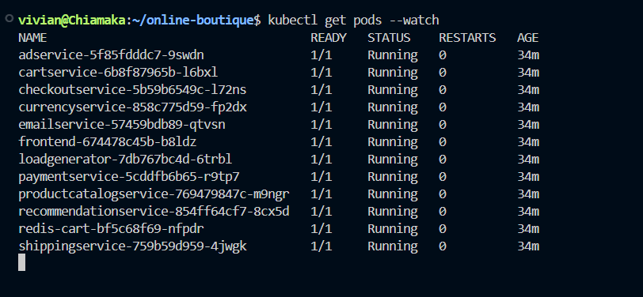
*All 11 services Running. Zero restarts.*

---

## Quick Start

```bash
# Prerequisites: Docker, kind, kubectl

# 1. Create cluster
kind create cluster --name online-boutique

# 2. Clone repo
git clone https://github.com/GoogleCloudPlatform/microservices-demo.git
cd microservices-demo

# 3. Deploy all 11 services
kubectl apply -f ./release/kubernetes-manifests.yaml

# 4. Wait for all pods to be Running (~5-10 min first run)
kubectl get pods --watch

# 5. Access the app
kubectl port-forward deployment/frontend 8080:8080
# Open: http://localhost:8080
```

---

## Environment Setup

Before anything runs, these are the tool versions used in this deployment.

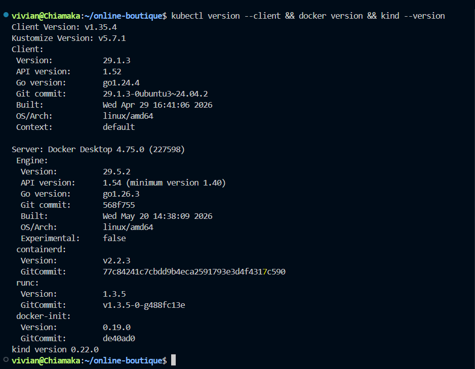
*Docker, kind, and kubectl versions confirmed before starting.*

---

## Cluster Creation

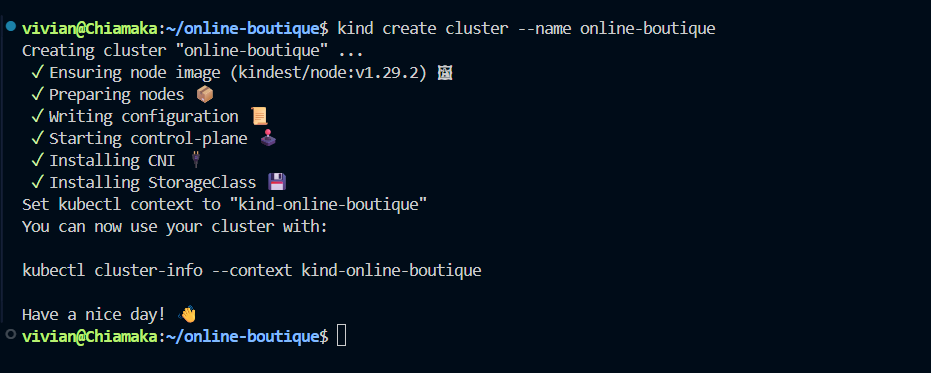
*kind cluster spun up successfully.*

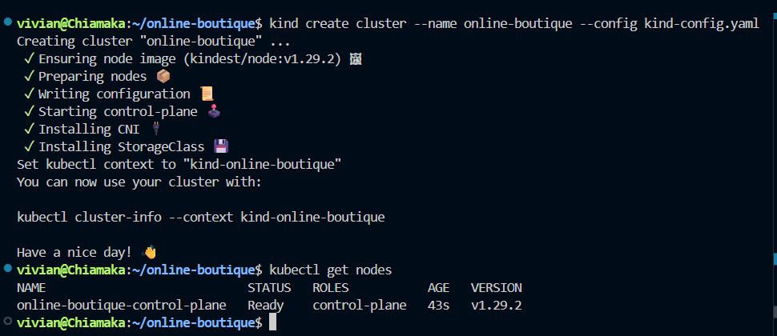
*kind bootstrapping the control plane and worker node inside Docker.*

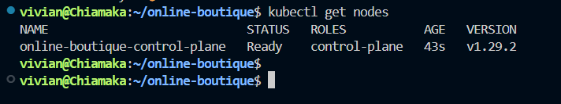
*One node, Ready status. The cluster is live.*

---

## Repo Structure

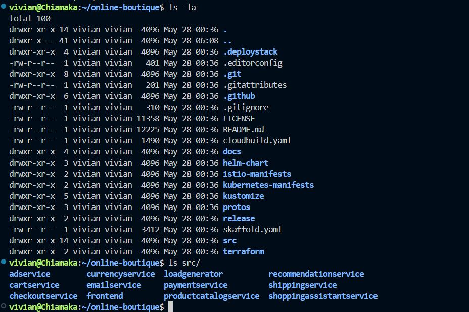
*The microservices-demo repo after cloning. The `release/` folder holds the manifests we apply.*

---

## Deploying the App

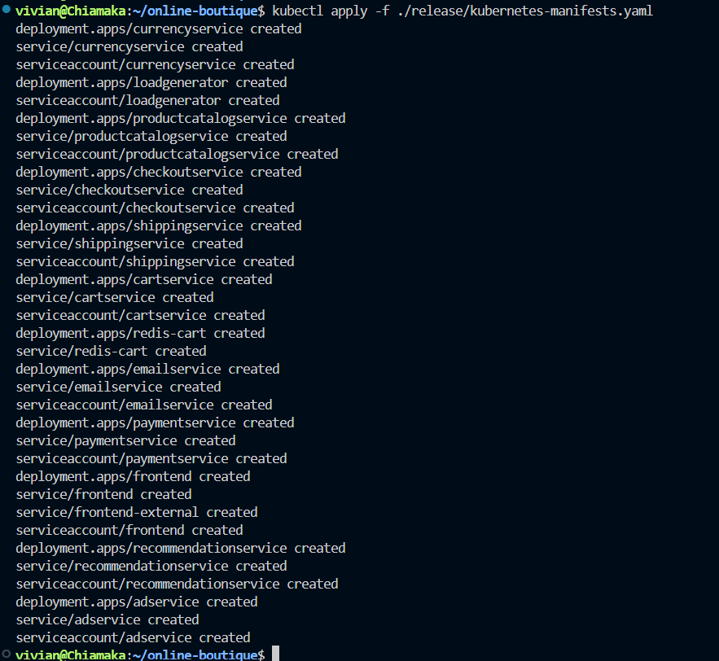
*All 11 Kubernetes resources created in one command.*

Pods do not start instantly. They go through `Pending` and `ContainerCreating` first while Kubernetes pulls images and schedules workloads.

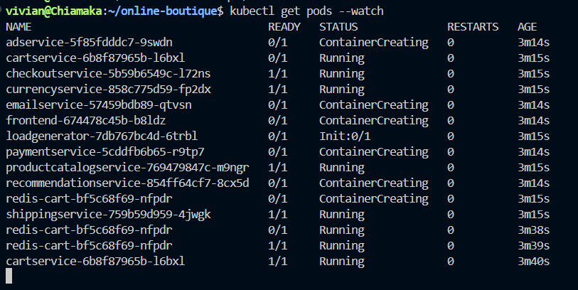
*Normal behavior. Nothing is broken here — images are still being pulled.*

Once all images are pulled and containers start, every pod moves to `Running`.


*All 11 services Running. Zero restarts.*

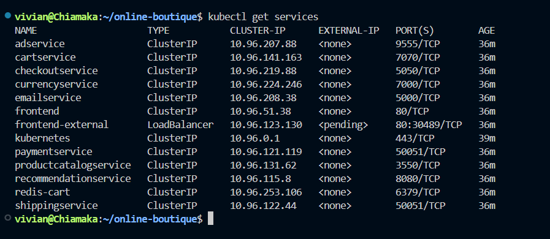
*Services and their ClusterIP addresses. The frontend service is the entry point.*

---

## The App

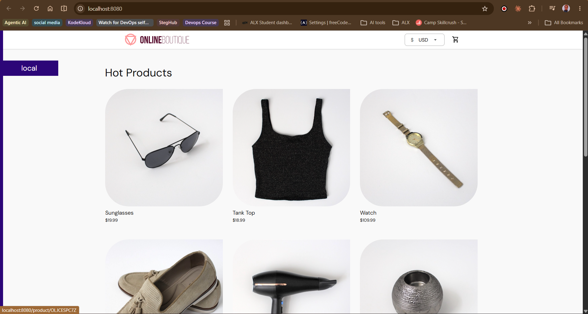
*Online Boutique running at localhost:8080*

An e-commerce store made up of **11 microservices across 5 programming languages**, all communicating over gRPC.

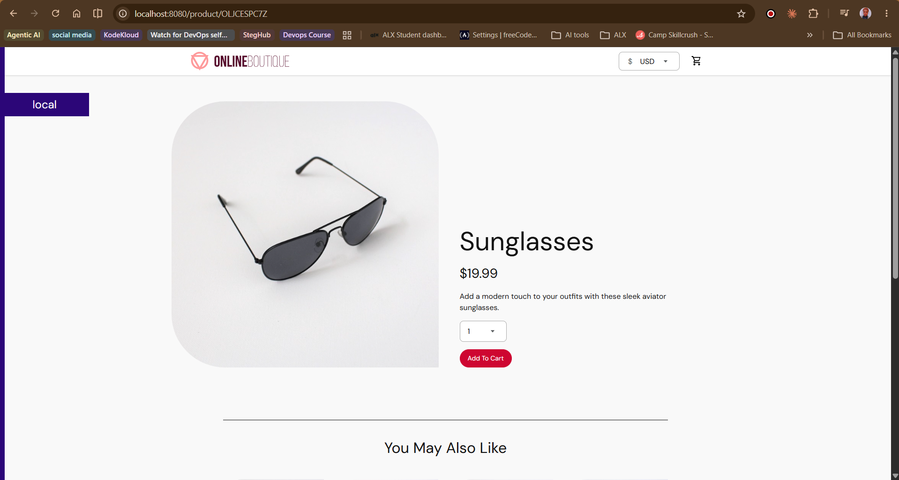
*Navigating to a product — frontend is calling productcatalogservice and recommendationservice behind the scenes.*

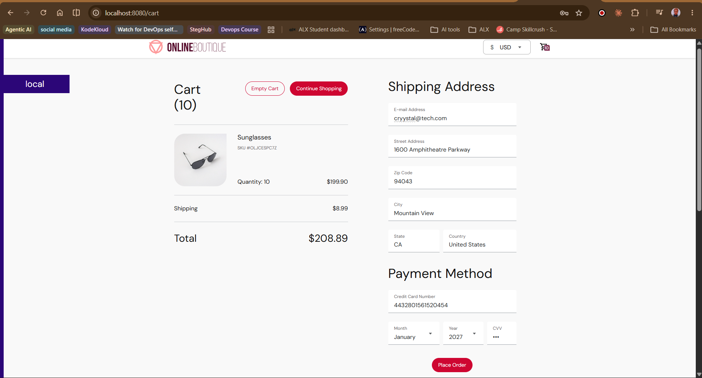
*Adding an item to the cart — cartservice storing the session in Redis over gRPC.*

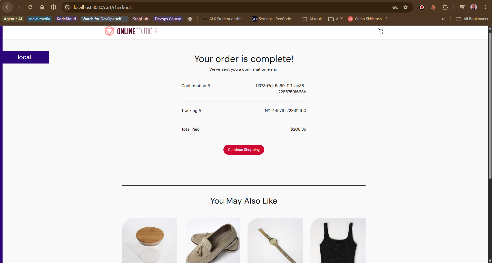
*Full checkout completed. checkoutservice coordinated 6 services to make this happen.*

---

## What Gets Deployed

```
NAME                          READY   STATUS    RESTARTS
adservice                     1/1     Running   0
cartservice                   1/1     Running   0
checkoutservice               1/1     Running   0
currencyservice               1/1     Running   0
emailservice                  1/1     Running   0
frontend                      1/1     Running   0
loadgenerator                 1/1     Running   0
paymentservice                1/1     Running   0
productcatalogservice         1/1     Running   0
recommendationservice         1/1     Running   0
shippingservice               1/1     Running   0
```

> **Note:** The `loadgenerator` starts sending simulated user traffic automatically the moment pods are Running. You will see live requests in frontend logs immediately — no configuration needed.

---

## Service Map

| Service | Language | Responsibility |
|---|---|---|
| frontend | Go | HTTP entry point. Calls every other service. |
| cartservice | C# | Stores cart data in Redis over gRPC. |
| productcatalogservice | Go | Returns product listings from a static JSON file. |
| checkoutservice | Go | Orchestrates the full order flow across 6 services. |
| paymentservice | Node.js | Simulates credit card processing. |
| emailservice | Python | Sends order confirmations (simulated). |
| currencyservice | Node.js | Handles currency conversion. |
| shippingservice | Go | Calculates shipping cost. |
| recommendationservice | Python | Suggests related products. |
| adservice | Java | Returns contextual ads. |
| loadgenerator | Python/Locust | Simulates real user traffic automatically. |

---

## Inspecting a Running Pod

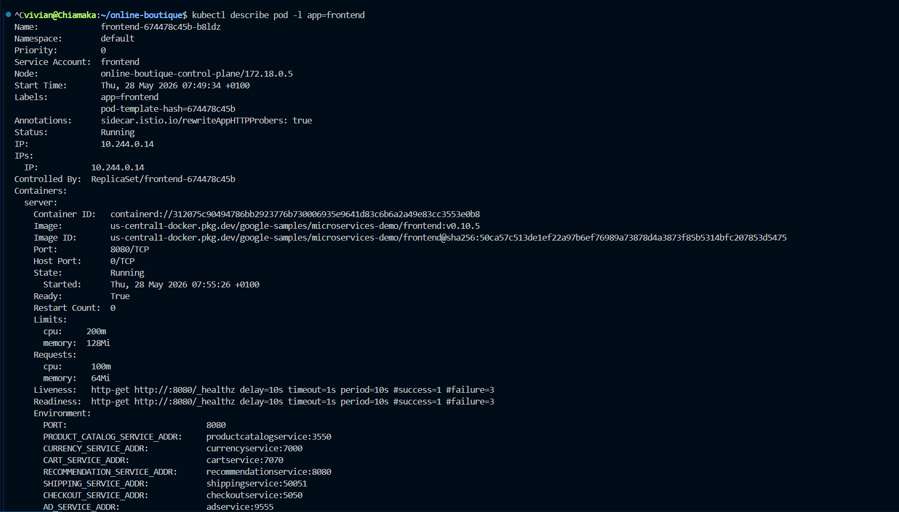
*Pod metadata: node assignment, IP, image pulled, resource requests and limits.*

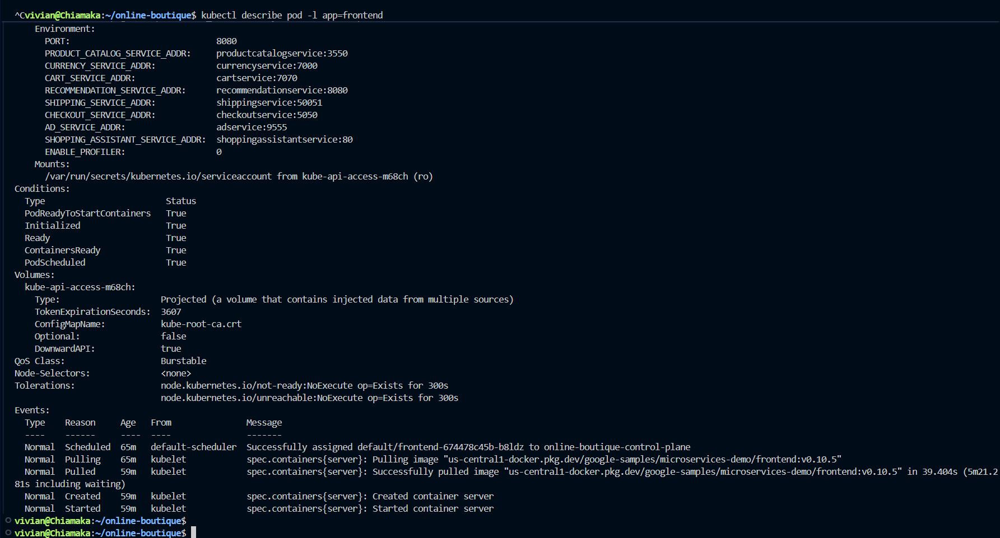
*Events section — shows the full lifecycle: Scheduled, Pulled, Created, Started.*

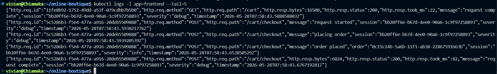
*Live request logs from the frontend. The loadgenerator is already sending traffic.*

---

## Resource Usage

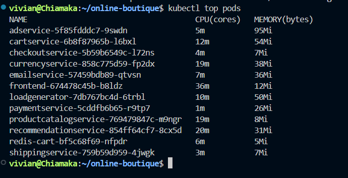
*CPU and memory consumption across all pods. adservice and frontend are the heaviest.*

---

## Fault Injection Experiment

After confirming everything was healthy, I injected a CPU stressor into `recommendationservice`:

```bash
kubectl exec -it deployment/recommendationservice -- sh -c "while true; do true; done"
```

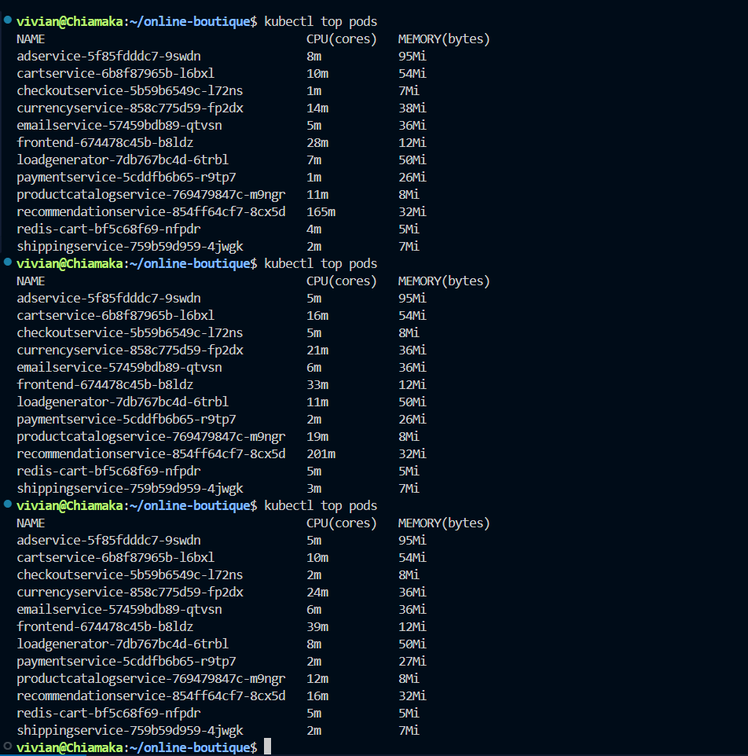
*The recommendation service under CPU pressure. The rest of the app kept running normally.*

**What happened:**
- The recommendation service slowed down under CPU pressure
- The rest of the app (cart, checkout, payment) kept working normally
- Kubernetes did **not** restart the pod — because it wasn't crashing, just degrading

**Recovery:**

```bash
kubectl delete pod -l app=recommendationservice
```

Kubernetes created a fresh pod in ~30 seconds. This experiment taught me that Kubernetes protects against failures, not degradation. For that you need resource limits, liveness probes, and readiness probes properly configured.

---

## Cleanup

```bash
# Remove all application resources
kubectl delete -f ./release/kubernetes-manifests.yaml

# Delete the cluster
kind delete cluster --name online-boutique
```

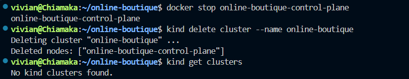
*All 11 resources deleted cleanly.*

---

## Full Walkthrough

Step-by-step guide including architecture breakdown, troubleshooting, and the full fault injection experiment:

- 📖 [Read on Dev.to](https://dev.to/vivianchiamaka)
- 📖 [Read on Hashnode](https://vivianchiamaka.hashnode.dev)

---

## About

**Vivian Chiamaka Okose** — Cloud DevOps Engineer, documenting the journey publicly.

[LinkedIn](https://linkedin.com/in/okosechiamaka) · [GitHub](https://github.com/vivianokose) · [X](https://x.com/vivianchiamaka)
